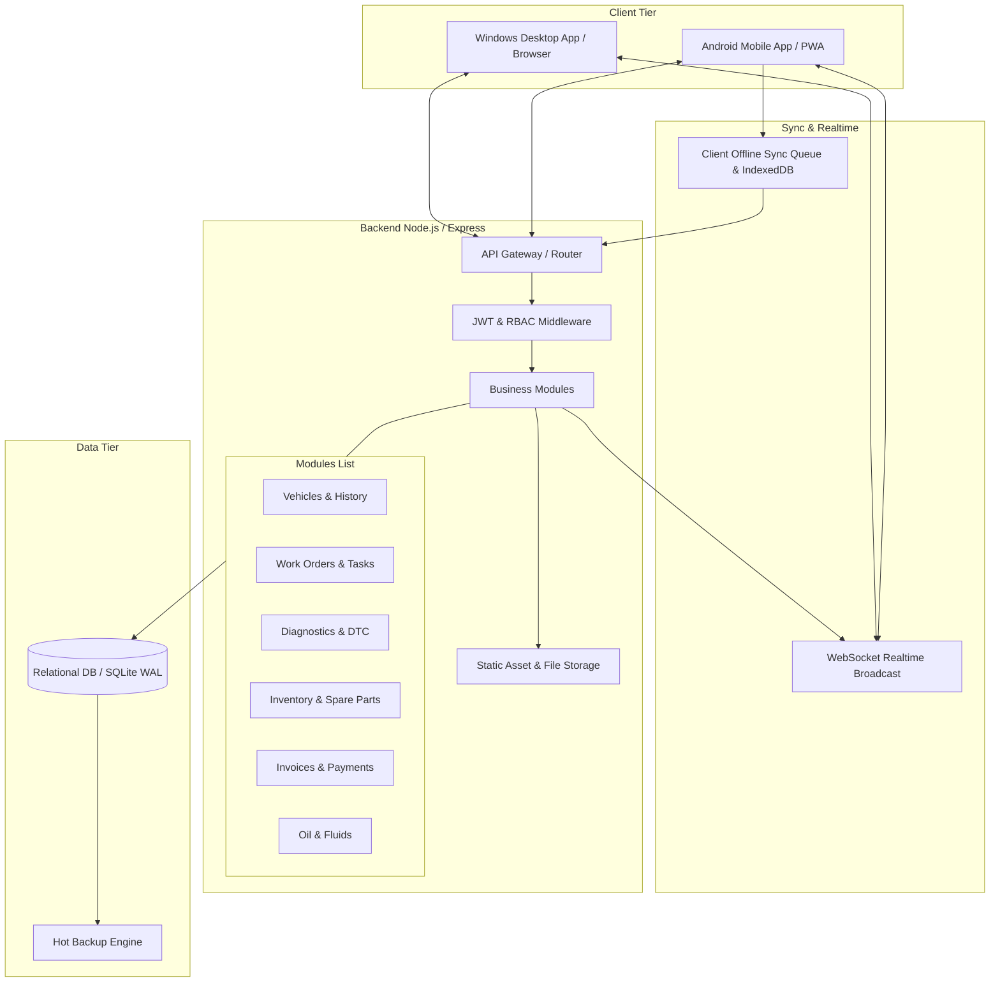

# وثيقة البنية المعمارية (Architecture Documentation)
## نظام إدارة ورشة ميكانيكا السيارات — Workshop Management System

---

## 1. نظرة عامة (Overview)

تم تصميم النظام ليكون منصة متكاملة ومركزية لإدارة ورش صيانة وميكانيكا السيارات، مع دعم بيئات العمل المتنوعة:
- **نظام سطح المكتب (Windows Desktop):** واجهة مخصصة لشاشات الحواسيب الكبيرة بإدارة كاملة (14 قسم رئيسي، تقارير موسعة، محاسبة، فواتير، تخطيط مهام).
- **نظام الهاتف (Android Mobile):** واجهة لمسية متجاوبة سريعة للفنيين وموظفي الاستقبال، تتيح فحص السيارات، التقاط الصور من موقع العمل، قراءة وتحديث أوامر الشغل، وإدخال أكواد الأعطال (DTC).
- **المزامنة في الوقت الفعلي (Real-time Sync):** تحديث فوري لكافة الأجهزة المتصلة عبر WebSockets عند حدوث أي تعديل، مع طابور مزامنة (Offline Sync Queue) للعمل دون اتصال بالإنترنت وإعادة المزامنة التلقائية فور عودة الاتصال.
- **اللغة والهوية:** دعم عربي كامل RTL أصيل مع خطوط حديثة وتصميم هندسي احترافي.

---

## 2. النمط المعماري (Architectural Pattern)

يتبع النظام معمارية **Modular Layered Architecture** (المعمارية النمطية متعددة الطبقات) مع فصل حاسم بين:
1. **Presentation Layer (Frontend):**
   - React + TypeScript + Vite
   - Tailwind CSS & Design Tokens مخصصة مع دعم RTL كامل (`dir="rtl"`, خط Cairo/Tajawal)
   - IndexedDB / LocalStorage للتشغيل غير المتصل (Offline State & Sync Queue)
   - WebSocket Client للاستماع للتغييرات الفورية وإعادة تحميل البيانات ديناميكياً
2. **API & Business Logic Layer (Backend):**
   - Node.js (v20+) + Express + TypeScript
   - Modular Route Handlers & Controllers
   - Security Middleware: JWT Authentication، Role-Based Access Control (RBAC)، Rate Limiting، Request Sanitization
   - WebSocket Server (WS/Socket.io) لبث الأحداث الفورية للأجهزة النشطة
   - File Processing Engine (Multer + Storage Manager) لتخزين وفحص ملفات الصور وتقارير PDF
3. **Data Persistence Layer (Database):**
   - Relational Database Engine: SQLite (better-sqlite3) مع نمط WAL (Write-Ahead Logging) عالي الأداء مع دعم الترحيل لـ PostgreSQL عند التوسع الضخم
   - Foreign Keys Enforcement & Strict ACID Transactions
   - Idempotency & Concurrency Locks لمنع السحب المزدوج لقطع الغيار
   - Migration Runner لإدارة إصدارات قاعدة البيانات بدون مساس ببيانات العملاء
   - Online Hot Backup Engine للنسخ الاحتياطي اللحظي

---

## 3. مخطط النظام المعماري (System Architecture Diagram)

---

## 4. تدفق العمليات الرئيسي (Key Business Workflows)

### 4.1 دخول السيارة وتاريخ الزيارة (Vehicle Intake & History)
1. الاستقبال يسجل أو يبحث عن العميل والسيارة (VIN / رقم اللوحة).
2. تسجيل زيارة جديدة مع قراءة العداد (Odometer) وشكوى العميل والصور الأولية.
3. فتح أمر عمل (Work Order) وتوزيع المهام على الفنيين.

### 4.2 فحص الأعطال (Diagnostics & DTC)
1. الفني يسجل التقرير التشخيصي (اسم وموديل الجهاز، النظام المفحوص).
2. إدخال أكواد الأعطال (DTC: P0301, P0420...) مع حالتها (Current, Pending, History) وFreeze Frame.
3. النظام يربط الكود بتاريخ السيارة ويتحقق إذا كان عطلاً متكرراً من زيارات سابقة.

### 4.3 صرف قطع الغيار والمخزون الآمن (Atomic Inventory Deduction)
1. عند استخدام قطعة غيار في مهمة، يتم إرسال طلب الصرف مع `idempotency_key`.
2. قاعدة البيانات تبدأ Transaction آمنة: فحص الرصيد المتاح، خصم الكمية، تسجيل حركة المخزون (Stock Movement).
3. منع السحب المكرر عند انقطاع الشبكة وإعادة إرسال الطلب.

### 4.4 المحاسبة والفوترة (Invoicing & Multi-Payments)
1. إنشاء فاتورة من أمر العمل وتفصيل أجور اليد وقطع الغيار والزيوت والخصم والضريبة.
2. دعم الدفعات الجزئية (تسجيل كل دفعة مع وسيلة الدفع وإصدار إيصال فوري).
3. تحديث الرصيد المتبقي تلقائياً.

---

## 5. استراتيجية المزامنة والتوافق (Compatibility & Sync)

- **الواجهة الموحدة:** بنيت الواجهة بتقنيات الويب الحديثة القابلة للتغليف مباشرة عبر Capacitor لتطبيقات Android الأصلية أو Electron / PWA لنظام Windows.
- **التشغيل متعدد الأجهزة:** يمكن للخادم أن يعمل محلياً في الورشة على خادم مركزي (LAN)، أو على سيرفر سحابي (Cloud VPS)، وتتصل به كافة أجهزة الويندوز وهواتف الأندرويد بسلاسة.
