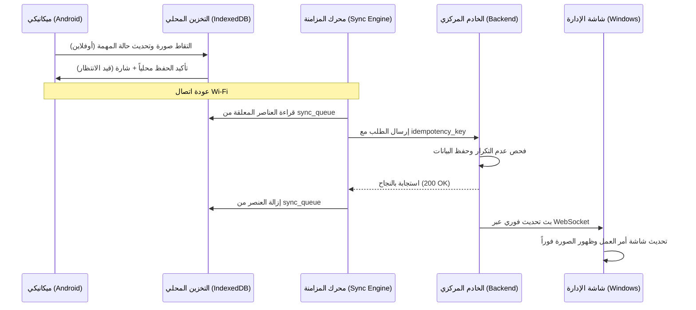

# وثيقة استراتيجية المزامنة والعمل دون اتصال (Sync Strategy & Offline Engine)
## نظام إدارة ورشة ميكانيكا السيارات

---

## 1. التحديات والأهداف (Goals & Challenges)

في بيئة الورش الميدانية:
- يتحرك الفني بين السيارات في حفر الصيانة وباحات الفحص حيث قد تضعف شبكة Wi-Fi أو تنقطع.
- يلتقط الفني صوراً للقطع التالفة ويكتب ملاحظات يجب ألا تضيع.
- يجب أن تظهر التعديلات التي يُجريها الفني على أجهزة الاستقبال والمدير على نظام Windows فور حفظها أو فور عودة الاتصال.
- يجب منع التكرار (Duplicate Requests) مثل خصم قطعة غيار مرتين عند انقطاع الشبكة وإعادة المحاولة.

---

## 2. عناصر البنية التحتية للمزامنة (Sync Components)

### 2.1 التحديث اللحظي عبر الويب سوكيت (Real-Time WebSocket Updates)
- عند فتح التطبيق على Windows أو Android، يتم إنشاء اتصال WebSocket آمن (`ws://` أو `wss://`) مع الخادم المركزي.
- عند إتمام أي عملية حفظ أو تعديل (مثل: تحديث مهمة، رفع صورة، تغيير حالة زيارة، إصدار فاتورة)، يقوم الخادم ببث حدث `EVENT_BROADCAST` لجميع الأجهزة النشطة:
  ```json
  {
    "type": "WORK_ORDER_UPDATED",
    "entity": "work_orders",
    "entityId": "wo_123",
    "action": "UPDATE",
    "timestamp": 1727952000000,
    "userId": "user_456"
  }
  ```
- عند تلقي العميل للحدث، تقوم واجهة المستخدم فوراً وبشكل صامت أو بإشعار خفيف بتحديث البيانات الظاهرة دون الحاجة لإعادة تحميل الصفحة يدوياً.

---

### 2.2 طابور المزامنة دون اتصال (Client-Side Offline Sync Queue)
- يُخزن التطبيق العمليات الميدانية غير المرسلة في مستودع محلي (IndexedDB / LocalStorage) تحت اسم `sync_queue`.
- يحتوي كل عنصر في الطابور على:
  - `id`: معرّف محلي فريد للعملية (UUIDv4)
  - `idempotency_key`: مفتاح عدم التكرار
  - `endpoint`: المسار البرمجي المطلوب (`/api/work-orders/tasks/status`, `/api/attachments/upload`...)
  - `method`: نوع الطلب (`POST`, `PUT`, `PATCH`)
  - `payload`: البيانات المُدخلة
  - `created_at`: توقيت العملية محلياً
  - `retry_count`: عدد محاولات الإرسال



---

### 2.3 استراتيجية فض النزاعات (Conflict Resolution)
1. **العمليات المالية والمخزنية:** لا يُستخدم فيها أسلوب "الكتابة الأخيرة تكسب" (Last-Write-Wins). تتم معالجتها بحركات دفترية تسلسلية (Audit-Driven Ledger).
2. **تحديث الحالات والمهام:**
   - استخدام حقل `version` أو `updated_at`.
   - في حال تعديل متزامن، يرجح التحديث الصادر عن المسؤول الأعلى رتبة أو يتم دمج الملاحظات في سجل التغييرات التاريخي (Activity Log).
3. **مفتاح عدم التكرار (Idempotency Key):**
   - يُنشئ العميل مفتاحاً فريداً لكل حركة خصم قطع غيار.
   - يستقبل الخادم المفتاح ويتحقق من جدول `stock_movements`. إذا كان المفتاح مسجلاً، يُرجع الخادم نجاح العملية مع بيانات الحركة السابقة دون تكرار الخصم.

---

### 2.4 مزامنة الصور والملفات الكبيرة (Media Sync)
- لا تُخزن الصور كنصوص Base64 في قاعدة البيانات.
- يتم ضغط الصور محلياً على الموبايل لتوفير استهلاك الشبكة وسرعة الرفع.
- يتم رفع الصور مع البيانات الوصفية (نوع الصورة: قبل/بعد، عطل، عداد، رقم الزيارة، رقم المهمة).
- يتيح الخادم روابط سريعة للصور مع دعم التخزين المؤقت (Caching).
